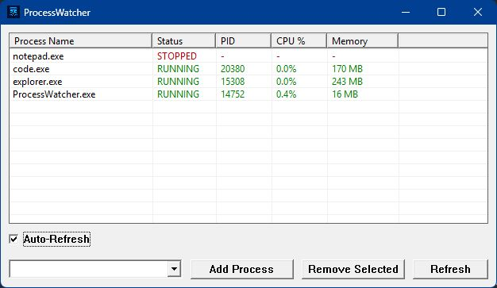

# ProcessWatcher - Win32 C Program

A lightweight Windows GUI application written in C using the Win32 API to monitor specific processes.



## Features

- Add/remove processes to watch by name or select from combo box dropdown
- Combo box shows all currently running processes for easy selection
- Allows typing process names directly for processes not running
- Real-time status display (RUNNING/STOPPED) with memory usage
- Shows PID (Process ID) and memory consumption in MB when running
- Shows CPU usage and last-seen timestamp for watched processes
- Color-coded display (Green = Running, Red = Stopped)
- Auto-refresh mode for continuous monitoring at a fixed 1-second interval
- Status bar shows paused/auto-refresh state
- Sort indicators in the list headers show the active sort column and direction
- `File` menu with `Refresh Now` and `Exit`
- `Options` menu for Auto-Refresh, Start with Windows, and Notify on Stop
- Windows notification when a watched process stops
- `F5` keyboard shortcut for manual refresh
- List view right-click actions for start process, open file location, Task Manager, end process, keep on top, and remove
- `Remove Selected` disables automatically when nothing is selected
- Saves watched processes and `Keep On Top` state in `ProcessWatcher.ini`
- Case-insensitive process name matching
- Lightweight native Win32 executable

## Compilation

### Prerequisites

- **MinGW** (Minimalist GNU for Windows) - includes gcc compiler
- Download from: https://www.mingw-w64.org/

### Compile

Option 1: Use the batch script
```bash
compile.bat
```

Option 2: Manual compilation with gcc (GUI mode - no console window)
```bash
windres ProcessWatcher.rc -O coff -o ProcessWatcher_res.o
gcc -Wall -Wextra -o ProcessWatcher.exe ProcessWatcher.c ProcessWatcher_res.o -lkernel32 -luser32 -lgdi32 -lpsapi -lcomctl32 -mwindows
```

Option 3: With MSVC (if installed)
```bash
cl ProcessWatcher.c kernel32.lib user32.lib gdi32.lib psapi.lib comctl32.lib /W3 /Fe:ProcessWatcher.exe /SUBSYSTEM:WINDOWS
```

## Usage

Run the executable:
```bash
ProcessWatcher.exe
```

### How to Use

1. **Add Process**: 
   - **Option A**: Click the dropdown arrow in the combo box to see all running processes and select one
   - **Option B**: Type a process name directly (e.g., `notepad.exe`, `chrome.exe`) - useful for processes not currently running
   - Then click "Add Process"
2. **View Status**: The table shows all watched processes with columns:
   - **Process Name**: Name of the watched process
   - **Status**: RUNNING or STOPPED status
   - **PID**: Process ID (shown when running)
   - **CPU %**: CPU usage for running processes
   - **Memory**: Memory usage in MB (shown when running)
   - **Last Seen**: Last observed running timestamp
3. **Refresh**: Use `File -> Refresh Now` or press `F5` to force an immediate refresh
4. **Options**: Use the `Options` menu to toggle Auto-Refresh, Start with Windows, and Notify on Stop
5. **Remove**: Select a process in the table and click "Remove Selected" (the button is disabled when nothing is selected)
6. **Context Menu**: Right-click a watched process to start it when its executable path is known, open its file location, open Task Manager, end the process, toggle Keep On Top, or remove it
7. **Status Bar**: When Auto-Refresh is off, the status bar shows `Paused` so stale data is obvious
8. **File Menu**: Use `File -> Exit` to close the application

## Notes

- Process names are case-insensitive (matching is done using Windows API)
- Saved process names are normalized when loaded, so Windows CRLF line endings do not break matching
- The combo box dropdown shows all currently running processes for easy selection
- Process list in combo box updates automatically when the combo loses focus
- Memory usage shown is the working set size in MB for running processes
- CPU usage is sampled during refreshes and auto-refresh ticks
- The `Start Process` action only becomes available after ProcessWatcher has learned the executable path for that watched process
- The program uses Win32 API's `CreateToolhelp32Snapshot` for efficient process enumeration
- Memory metrics are retrieved using `GetProcessMemoryInfo`
- Auto-refresh uses a fixed 1-second window timer/message loop, avoiding a background thread shutdown race
- Watched processes and window `Keep On Top` state are persisted in `ProcessWatcher.ini`
- Stop notifications use the Windows notification system and depend on the shell/taskbar being available
- The executable icon is embedded from `ProcessWatcher.ico` via `ProcessWatcher.rc`
- No external dependencies required once compiled
- Default window size: 760x340 pixels

## Building with MSVC

If you have Visual Studio, you can compile with:
```bash
cl ProcessWatcher.c kernel32.lib user32.lib gdi32.lib psapi.lib comctl32.lib /W3 /Fe:ProcessWatcher.exe /SUBSYSTEM:WINDOWS
```

This will create a native Win32 executable that runs on any Windows system with no dependencies.
